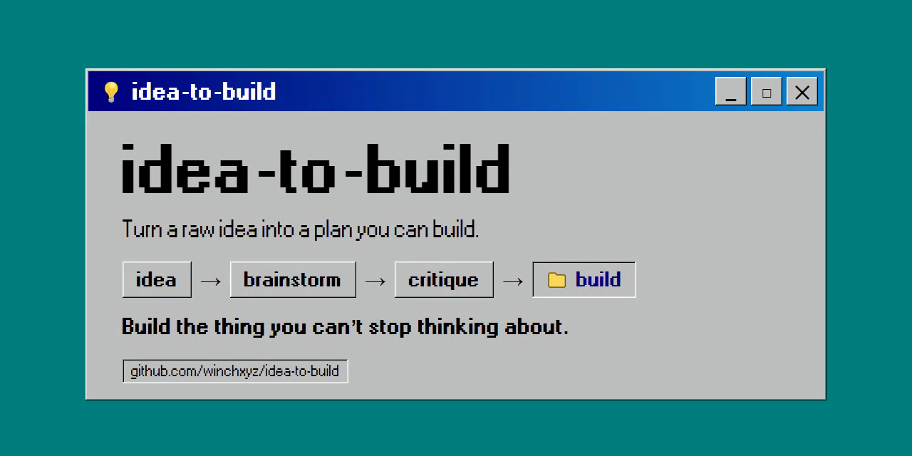

<div align="center">



# idea-to-build

**A multi-agent brainstorming methodology that takes a raw idea to a plan you can build — for founders, builders, and creators.**

Turn a raw idea into a plan you can actually build — in about 30 minutes. Claude sub-agents research it, argue with it, and won't let you skip the hard parts; when it's done, it hands the whole thing to Claude Code ready to build.

[](https://opensource.org/licenses/MIT)
[](https://claude.com)
[](CONTRIBUTING.md)
[](CHANGELOG.md)

[Quick Start](#-quick-start) • [See It in Action](#-see-it-in-action) • [How It Works](#-how-it-works) • [Profiles](#-profiles) • [Why This](#-why-this-vs-alternatives) • [Contribute](CONTRIBUTING.md)

</div>

---

## The Problem

LLMs are great at telling you why your idea is brilliant. They're terrible at telling you why it will fail.

Ask any LLM — Claude, ChatGPT, Gemini, Grok — to brainstorm and you get the same failure modes:
- ❌ Same-side agreement (no real pushback)
- ❌ Fabricated market sizes and made-up statistics
- ❌ Generic SWOT lists that fit any business
- ❌ "5 great ideas!" — none of which are actually different
- ❌ No memory across sessions — you re-explain context every time

This tool fixes those failures. The **full multi-agent version runs on Claude** (Cowork or Claude Code) — that's where sub-agent isolation lives. A **degraded-but-functional standalone prompt** in `distributions/standalone-prompts/lite.md` works in any other LLM.

## The Solution

**A structured 6-phase brainstorming flow with dedicated sub-agents.** Each phase has a specialist that doesn't see what the others did — so the critic actually criticizes, the researcher actually researches, and the planner actually plans.

It's the same way professional strategy teams work: separate people for ideation, critique, and execution. We just made each "person" a specialized Claude agent.

And when the brainstorm is done, `/scaffold` hands the whole thing to Claude Code as a ready-to-build folder — the chosen approach, the paths you rejected, the risks to watch, the go/no-go gates. Idea in, buildable plan out. That's the "to-build" in the name.

> "It found a flaw in my pivot that I'd been missing for three weeks." — early tester

---

## 👀 See It in Action

https://github.com/user-attachments/assets/b3c68305-1573-43d5-80f3-f496d2ab7f2f

Real sessions, each linked in full — strongest first. Most put one prompt through a normal chat vs. the methodology, side by side; one runs a single idea through all six profiles; the first is a complete start-to-finish run that ends in a buildable plan:

- [**Full run: medieval tycoon game**](examples/medieval-tycoon-fullrun.md) — the whole method, Phase 1 → 6 → `/scaffold`. A vague "tycoon game" comes out scoped, critiqued (GO with conditions), planned with a kill-switch, and handed off as a buildable folder. **Start here — it's the idea→build arc end to end.**
- [**Hyperliquid wallet**](examples/hyperliquid-wallet-comparison.md) — the deepest comparison: the full method through a trace-verified isolated Phase-5 critique. Read this to see the rigor.
- [**Personal health AI**](examples/health-system-comparison.md) — the harder case: plain Claude was already competent, and the methodology still added strategy (beachhead, regulatory risk, an architectural blocker).
- [**Profiles in action**](examples/profiles-comparison.md) — the *same* idea run through all six profiles, showing how each asks different questions. Proof the profiles aren't cosmetic.
- [**Food delivery app**](examples/food-delivery-comparison.md) — the "can it say no?" test (trace-verified): the cold critic returns NO-GO on the head-on idea, then GO-with-conditions on the pivot.
- [**AI support agent**](examples/ai-support-agent-comparison.md) — another honest NO-GO: the methodology pushes back and recommends *not* building the idea.
- [**Stickman game**](examples/stickman-comparison.md) — the simplest contrast: plain Claude builds instantly, the methodology stops to scope. A quick way to see the difference.

---

## 🚀 Quick Start

Two install paths ship today. Two more are on the roadmap.

### ✅ Option 1: GitHub template / Cowork folder (available now)
```bash
git clone https://github.com/winchxyz/idea-to-build.git
```
Open the cloned folder in Cowork (or Claude Code). The root [`CLAUDE.md`](CLAUDE.md) activates the coordinator and sub-agents automatically — it bootstraps the full specification in `core/CLAUDE.md`.

### ✅ Option 2: Standalone prompt — any LLM (available now)
Copy [`distributions/standalone-prompts/lite.md`](distributions/standalone-prompts/lite.md) into ChatGPT, Claude, Gemini, or any chat. Degraded quality (no sub-agent isolation, no cross-session memory), but zero setup.

### 🚧 Option 3: Cowork plugin (.plugin) — on roadmap
A drag-and-drop `.plugin` installer is planned for v0.2. Track [issue #1](https://github.com/winchxyz/idea-to-build/issues/1) for status.

### 🚧 Option 4: Claude Code plugin — on roadmap
Marketplace registration and `claude plugin install` support are planned for v0.2. Track [issue #2](https://github.com/winchxyz/idea-to-build/issues/2) for status.

---

## 🧩 How It Works

A coordinator agent guides you through six phases. For the two most-skipped phases — critique and planning — it spawns isolated sub-agents that can't see the conversation, so they can't drink the Kool-Aid. When the plan is done, a scaffolder turns the whole brainstorm into a folder Claude Code can build from.

```
┌────────────────────────────────────────────────────────────────┐
│                    Coordinator (you talk to)                   │
│                                                                │
│  Phase 1 ─ Understanding   "What are you actually trying to    │
│                             accomplish?"                       │
│  Phase 2 ─ Context         🔍 Research Agent (optional)        │
│  Phase 3 ─ Generation      💡 Ideation Agent (optional)        │
│  Phase 4 ─ Deep Dive       🔬 Deep-Dive Agent (optional)       │
│  Phase 5 ─ Critique        ⚔️  Critic Sub-Agent  ◄── isolated │
│                             Sees: final choice only            │
│                             Forced: premortem + steelman       │
│  Phase 6 ─ Plan            📋 Planner Sub-Agent  ◄── isolated │
│                             Sees: choice + critique            │
│                             Forced: actionable steps + gates   │
├────────────────────────────────────────────────────────────────┤
│  /scaffold ───────────────▶ 📦 Scaffolder → buildable folder   │
│                             (CLAUDE.md · README · DECISIONS ·   │
│                              PLAN) → open in Claude Code, build │
└────────────────────────────────────────────────────────────────┘
```

**Why isolation matters:** A critic that has seen 30 messages of you defending an idea is biased toward letting you keep it. A critic that sees only "the user chose X, premortem it" has no such bias. This is the single biggest quality lever — and the reason the plan you walk out with is one you can actually build, not just a nicer version of what you already believed.

---

## 📚 Profiles

idea-to-build ships with **6 modes**: one general-purpose base plus five domain specializations.

| Profile | When to use | Key tools |
|---------|-------------|-----------|
| 🎯 [General](profiles/general.md) | Any idea, any domain | Full 6-phase framework |
| 🚀 [Startup](profiles/startup.md) | Founder ideating a product/business | Unit economics, GTM, JTBD, Beachhead |
| ⚙️ [Tech Architecture](profiles/tech-architecture.md) | System design, stack choices | Trade-off matrices, RFC structure |
| 🎬 [Content Strategy](profiles/content-strategy.md) | Channel, niche, monetization | Audience-fit, virality patterns, RPM |
| 🗺️ [Product Roadmap](profiles/product-roadmap.md) | Feature prioritization, GTM | ICE/RICE, Kano, North Star Metric |
| 🧭 [Personal Decisions](profiles/personal-decisions.md) | Career moves, life transitions | Reversibility, Expected Value, Inversion |

Profiles override defaults inside each phase. Switch with `/profile startup` — a real slash command in Claude Code and the Claude CLI; in Cowork, just say it in plain language ("switch to the startup profile"). See all six compared on one idea: [`profiles-comparison.md`](examples/profiles-comparison.md).

---

## 🆚 Why This vs Alternatives

| | Raw ChatGPT/Claude | Awesome-prompts repo | LangChain/CrewAI build | **idea-to-build** |
|---|---|---|---|---|
| Setup time | 0 sec | 30 sec | 30+ min | ✅ 60 sec |
| Forced critique | ❌ | ⚠️ Often skipped | ✅ if coded | ✅ Hard-gated |
| Fact-checking discipline | ❌ Hallucinates | ❌ No enforcement | ⚠️ DIY | ✅ Tier 1/2/3 protocol |
| Cross-session memory | ❌ | ❌ | ✅ if coded | ✅ Context files |
| Phase isolation | ❌ Single context bleed | ❌ | ✅ if multi-agent | ✅ Sub-agents native |
| Domain profiles | ❌ One-size | ❌ | ⚠️ DIY | ✅ 6 ready |
| Ends in a buildable plan | ❌ Just a chat | ❌ | ⚠️ DIY | ✅ `/scaffold` → folder Claude Code builds |
| Cost per brainstorm | Free–$1 | Free | $$ (LLM API) | Free (your Claude subscription) |

More questions — *is it really multi-agent? could a prompt do this? does it actually say no?* — see the [**FAQ**](docs/FAQ.md).

---

## 🎯 Core Principles

1. **Skeptical by default.** Every claim — yours, the user's, the source's — is a hypothesis to be tested. Accuracy over confidence, clarity over speed, evidence over assumption. When uncertain, the tool tells you exactly what would verify the claim.
2. **Phase-explicit communication.** Coordinator announces the current phase in every message. No silent transitions.
3. **Factual rigor (Tier 1/2/3).** Made-up numbers are a sin. Each material claim gets a ✅ / ⚠️ / 🔍 confidence label.
4. **Calibrated recommendations.** Every recommendation includes a confidence percentage, what would raise/lower it, and an alternative if confidence drops. No false certainty.
5. **Forced critique.** Phase 5 cannot be skipped. Premortem + What-Needs-to-Be-True are mandatory.
6. **Sub-agent isolation.** Critic and Planner agents work in fresh context. They cannot inherit your biases.
7. **Memory as a log, not state.** Decisions and rejected options are appended, never overwritten. History matters.
8. **Ends in a build, not just a brainstorm.** The point isn't a tidy writeup — it's a scoped, critiqued plan you can act on. `/scaffold` turns the finished brainstorm into a folder Claude Code builds from.

Full methodology: [`docs/METHODOLOGY.md`](docs/METHODOLOGY.md)

---

## 🏗️ Architecture

```
idea-to-build/
├── CLAUDE.md                 # Entry point — auto-activates the coordinator
├── .claude/skills/           # Slash commands for Claude Code / CLI (/profile, /critique, /plan…)
├── core/
│   ├── CLAUDE.md             # Full coordinator specification
│   ├── agents/               # 6 agents: research, ideation, deep-dive, critic, planner, scaffolder
│   ├── skills/               # Recommendation + confidence module
│   └── templates/            # Project context file template
├── profiles/                 # 6 domain profiles (general + 5 specialized)
├── distributions/
│   └── standalone-prompts/   # Lite version for any LLM
├── docs/
│   ├── ARCHITECTURE.md       # How sub-agents are orchestrated
│   ├── METHODOLOGY.md        # Core principles in depth
│   ├── PHASES.md             # 6 phases explained
│   ├── PROFILES.md           # Profile authoring guide
│   └── FAQ.md                # Common questions, answered honestly
└── examples/                 # Template, guide + real comparison transcripts
```

> Roadmap directories not yet shipped (planned for v0.2): `distributions/cowork-plugin/`, `distributions/claude-code-plugin/`. The `examples/` directory ships with a template, an authoring guide, and seven real transcripts — five run the same prompt as plain Claude vs. through the methodology: a stickman game, a personal-health-AI startup, a Hyperliquid wallet (full methodology through a trace-verified Phase 5 critique → NO-GO), an AI support agent, and a food-delivery app (where a trace-verified isolated critic returns NO-GO on the head-on idea, then GO-with-conditions on the pivot) — plus a profiles comparison (one idea, six profiles) and a full start-to-finish run that ends in a buildable plan. A broader library lands in v0.2. See [`CHANGELOG.md`](CHANGELOG.md).

Full architecture: [`docs/ARCHITECTURE.md`](docs/ARCHITECTURE.md)

---

## 🤝 Contributing

We welcome:
- 🆕 New profiles for specific domains (legal, healthcare, education, climate, etc.)
- 🛠️ Improvements to sub-agent prompts
- 📖 Real-world brainstorm transcripts for `examples/`
- 🌍 Translations (currently English-first; methodology language-agnostic)
- 🐛 Bug reports and edge cases

See [`CONTRIBUTING.md`](CONTRIBUTING.md).

---

## 📜 License

MIT — see [`LICENSE`](LICENSE). Use it, fork it, ship it commercially. Just don't sue us if your brainstorm convinces you to do something dumb.

---

## ⭐ Star History

If `idea-to-build` helped you avoid a bad decision (or commit to a good one), a star makes our day.

[](https://star-history.com/#winchxyz/idea-to-build&Date)

---

<div align="center">
Built with 🧠 by people who got tired of LLMs agreeing with them.
</div>
